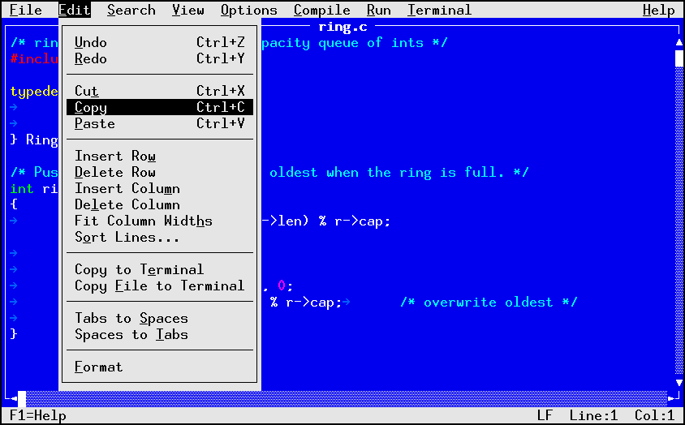

# vedit

A single-file visual text editor for primitive terminals. vedit emulates a
modeless Microsoft EDIT personality and a vi personality. It draws through a
small cell grid that emits a fixed subset of ANSI control codes, with no
terminfo database and no differential compositor, so it runs over a telnet or
ssh link to a simple terminal emulator such as a MUD client.

vedit is one source file (`vedit.c`) plus a public header for embedding
(`vedit.h`).


`docs/demo.html` is a self-contained page that illustrates the rendering work
(the scroll fast path, the color schemes, the line-number gutter, word wrap, and
the unified palette), with mockups drawn from vedit's real output.

## Building

```sh
make                    # build ./vedit
make RELEASE=1          # optimized build
make static             # static musl build, for dropping onto a server
make install            # install to ~/.local/bin (override PREFIX)
```

The only requirement is a C11 compiler and a POSIX system. There are no library
dependencies.

## Testing

```sh
make test               # unit and render tests through the taptest driver
make torture            # pseudo-random fuzz of the parsers and regex engine
make asan               # tests + torture under AddressSanitizer (with leaks)
make ubsan              # tests + torture under UndefinedBehaviorSanitizer
make cov                # line coverage of vedit.c from the unit tests
```

The tests live in `tests/` and run through a vendored copy of the `taptest`
TAP framework (its driver plus `test.h` / `testmain.c`). There are no external
dependencies. Each test file includes `vedit.c` as a single unit, with `main`
renamed, so it can call the internal helpers directly; integration tests drive
the editor over an in-memory `vedit_io` (`tests/memio.h`) that feeds scripted
keystrokes and captures the output, so no terminal is needed. `test_unit.c`
covers the pure helpers (UTF-8, rune width, color mapping, word-wrap layout, the
syntax tokenizer, buffer edits and undo); `test_render.c` drives whole-editor
behavior (cursor jumps, wrap, the gutter, status flags).

`tests/torture.c` is a fuzz suite that drives the untrusted-input surfaces, the
regex engine as search and replace use it, the config parser, and the UTF-8
codec, with pseudo-random input and a deterministic PRNG. It is not a
correctness oracle; it checks a few invariants and leans on the sanitizers to
catch memory and undefined-behavior faults. Set `TORTURE_ROUNDS` to change the
iteration count, and pass a seed as the second argument to `tests/torturet` to
reproduce a run.

CI (`.github/workflows/ci.yml`) runs the build and tests on gcc and clang, the
two sanitizer suites, and the torture fuzz on every push and pull request. A
single `ci-ok` job gates on all of them, so branch protection can require that
one check.

## Running

```sh
vedit [file]
```

A missing file opens as a new, named buffer. Opening a file that is already open,
even by a different spelling (a symlink, a `./` or `../` detour, or a hard link),
switches to the existing buffer rather than loading a second copy. vedit requires
a terminal on both stdin and stdout when run from the command line.

### Box-drawing mode

The frame, scrollbars, and menus draw three ways, chosen for the client:

```sh
vedit --utf8 file     # Unicode box-drawing
vedit --dec  file     # DEC VT100 line-drawing (single-byte, widely supported)
vedit --ascii file    # plain ASCII:  + - | ^ v # :
```

The default is UTF-8 under a UTF-8 locale and ASCII otherwise. `VEDIT_BOX=utf8|
dec|ascii` and `VEDIT_ASCII` set it from the environment. DEC line-drawing is a
good middle ground for older clients that cannot render UTF-8 box-drawing but do
support the VT100 alternate charset.

### Color depth

```sh
vedit --256color file   # full xterm 256-color palette
vedit --16color file    # map everything to the 16 ANSI colors
```

The default is 256 when `TERM` or `COLORTERM` says the terminal supports it, and
16 otherwise; `VEDIT_COLORS=256|16` overrides. In 16-color mode every color is
mapped to the nearest of the 16 ANSI colors and sent with the classic `30`-`37` /
`90`-`97` SGR codes, which the most limited clients understand. Syntax
highlighting uses a separate, punchier palette in this mode, since the 256-color
scheme's pastels would otherwise collapse toward white.

### Fast scrolling

```sh
vedit --scroll file     # use the terminal scroll region (fewer bytes)
vedit --no-scroll file  # repaint instead (the default)
```

When the viewport scrolls or a line is inserted, the whole text area normally
shifts, so without help every visible row is repainted. With `--scroll` the
editor moves the text region with the terminal's scroll region (DECSTBM plus
`IND` / `RI`) and repaints only the one newly exposed line, which is a large
saving on a slow link. It is off by default because it relies on VT100
scroll-region support, which the most primitive line-at-a-time clients lack.
`VEDIT_SCROLL=1` turns it on from the environment, and an embedding host that
knows the client calls `vedit_set_scroll()`.

Two redraw savings are always on and need no flag: only rows that changed are
sent, and within a row only the columns between the first and last change are
repainted. On the black color scheme (below), a long run of trailing blanks in a
changed row is cleared with one erase-to-EOL instead of a column of spaces.

### Configuration file

A gitconfig-style file sets the startup defaults. It is read from the first of
`$VEDIT_CONFIG`, `$XDG_CONFIG_HOME/vedit/config`, and `~/.veditrc` that exists;
`--config FILE` points at a specific file and `--no-config` skips it.

```ini
# ~/.veditrc
[ui]
    scheme = black      # dos | black | plain
    number = on         # line-number gutter
    wrap   = on         # word wrap
    box    = dec         # utf8 | dec | ascii
    colors = 256         # 256 | 16
    scroll = on          # VT100 scroll-region fast path
    clipboard = off      # also mirror every copy/yank to the terminal (OSC 52)
    tabs   = on          # mark hard tabs with a guide glyph

[edit]
    mode = vi            # vi | modeless
    autoindent = on      # new lines copy the previous indent

[indent]
    expand = off         # off = indent with tabs, on = with spaces

[tags]
    file = /path/to/tags # ctags index; else a "tags" file beside the buffer

[cc]
    file = /path/to/compile_commands.json # include paths for gf / Open Header

[error]
    pattern = ^([^(]+)\(([0-9]+),([0-9]+)\):  # extra build-error format

[syntax]
    enable = on          # highlight recognized file types
```

Keys are dotted, so `ui.scheme = black` without a section header works too.
Booleans accept `on`/`off`, `yes`/`no`, `true`/`false`, or `1`/`0`. A missing or
unreadable file is ignored (an explicit `--config` path that cannot be read
prints a warning and the editor still starts).

The keys that usually differ from one project to the next can be overridden by an
environment variable, which is handy in a per-project shell or an `.envrc`. The
variable is `VEDIT_` followed by the key uppercased with each `.` turned into `_`,
and a set, non-empty value wins over the config file:

| Config key                 | Environment variable       |
| -------------------------- | -------------------------- |
| `tags.file`                | `VEDIT_TAGS_FILE`          |
| `cc.file`                  | `VEDIT_CC_FILE`            |
| `command.<lang>.compile`   | `VEDIT_COMMAND_<LANG>_COMPILE` |
| `command.<lang>.build`     | `VEDIT_COMMAND_<LANG>_BUILD`   |
| `command.<lang>.run`       | `VEDIT_COMMAND_<LANG>_RUN`     |

Only these per-project keys read the environment; editor preferences such as the
theme or key mode stay in the config file.

After editing the config file, reload it without restarting: the `:reload` ex
command, or Options > Reload Config. It re-reads the file named at startup and
re-applies everything (the scheme and themes, box mode and colors, syntax
grammars, and the editor toggles). A session started with `--no-config`, or one
embedded in a host that supplies its own config, has no file to reload and says
so.

A `[theme "name"]` section defines a custom color scheme that `ui.scheme = name`
then selects, alongside the three built-ins:

```ini
[theme "midnight"]
    base         = black      # start from dos | black | plain (default dos)
    content.fg   = 189        # the text area
    content.bg   = default
    frame.fg     = 60         # window border and scrollbars
    frame.bg     = default
    title.fg     = "#ffd787"  # file name in the top border (quote a hex color)
    bar.fg       = 231        # menu bar and status bar
    bar.bg       = 54
    reverse-bars = off        # draw the bars in reverse video
    borderless   = on         # drop the right border so text reaches the edge
```

A `[command "<lang>"]` section sets the per-language build commands (see
[Build commands](#build-commands-a-primitive-ide)).

A color is `default` (the terminal's own color), a 0-255 palette index,
`#rrggbb`, or one of the sixteen ANSI names (`red`, `cyan`, ..., with a
`bright-` prefix for 8-15). A `#rrggbb` value must be quoted, since an unquoted
`#` starts a comment; quoting also protects any value with a `#` or trailing
spaces. Unset fields keep the base preset's value, and `base
= black` turns `borderless` on unless the theme sets it off. Up to eight themes
can be defined.

Settings rank from weakest to strongest: built-in default, then the config file,
then the `VEDIT_*` environment variables, then the command-line flags, then an
embedding host's `vedit_set_*()` calls. So a `--dec` flag or `VEDIT_BOX` beats
`ui.box` in the file, and the host always wins. The core never opens the file
itself; the command-line front end reads it and hands it in through
`vedit_set_config()`, which an embedding host can also call with a config it
builds from `vedit_cfg_new()` / `vedit_cfg_load()`.

### Custom syntax highlighting

Beyond the built-in C and shell highlighters, the config file can define a
language as a small state machine (the model joe uses), authored in the same
gitconfig format, no separate file. A language is a set of states; each state
has an ordered list of transition `rule` lines keyed on a character set.

```ini
[syntax]
    enable = on
    mn = mini             # map an extension to a language (or :syntax mini)

[color "mini"]            # class -> color [attrs], same grammar as themes
    kw  = "#ffd700"
    num = cyan

[words "mini.keywords"]   # keyword groups; split on spaces, multiple lines ok
    list = if else while return
    list = for do break continue

[state "mini.idle"]       # the first state is the start (or language.mini.start)
    color = text
    rule = "0-9"       num   recolor
    rule = "a-zA-Z_"   word  buffer
    rule = *           idle

[state "mini.num"]
    color = num
    rule = "0-9."      num
    rule = *           idle  noeat

[state "mini.word"]
    color = text
    rule = "a-zA-Z0-9_" word
    rule = *            idle noeat kw=mini.keywords:kw
```

Each `rule` is `charset  target-state  [options]`:

- **charset** is `*` (any byte, put it last) or a quoted set with ranges and
  escapes, for example `"a-zA-Z0-9_"`, `"0-9"`, `"\t\n"`, `"\""`.
- **options**: `noeat` re-processes the byte in the target state without
  consuming it; `recolor` (or `recolor=N`) repaints the last byte (or N bytes)
  in the target state's color; `buffer` starts recording a token;
  `kw=<group>:<class>` matches the buffered token against a `[words]` group and,
  on a hit, repaints it in `<class>`; `mark` and `recolormark` handle a region
  whose length is not known until its end is seen (see below). Colors accept
  attributes (`bold`, `underline`, `reverse`, `dim`, `italic`), e.g.
  `keyword = yellow bold`.

A state may also set `include = <other-state>`: when none of its own rules
match the byte, the machine falls through to the included state's rules (and
their includes, in turn). The including state keeps its own color, so a shared
rule set (operators, identifiers, whitespace) can be written once and reused.

`mark` records the current position, and a later rule with `recolormark`
repaints everything from that mark up to the current byte in the target state's
color. Unlike `recolor=N`, the span length need not be known in advance, so a
preprocessor line, an include like `<stdio.h>`, or a here-document body can be
colored as one region once its end matches. The mark is per line and defaults
to the start of the line, so on a continuation line of a multi-line region the
repaint starts at the left edge.

The carry state between lines is the current state, so multi-line constructs
(block comments, here-strings) work by staying in a state at end of line. At the
end of each line a newline is fed to the machine (as joe does), so a state that
should not span lines, such as a `//` line comment, returns to idle with a
`rule = "\n" idle`; a state with only a `*` rule stays and carries on. The
newline flush also lets a bare keyword at the very end of a line be recognized.
A language whose name matches a file extension is picked up automatically; a
`syntax.<ext> = <name>` line maps any other extension. The core reads no files:
the rules are config data, loaded through `vedit_set_config()` like everything
else.

The built-in C and shell highlighters are themselves grammars in this format,
compiled into the binary and loaded at startup, so they need no config file.
Defining a language of the same name in your config replaces the matching
built-in outright (the two are not merged), so to customize one, copy its whole
grammar and edit it rather than setting a single color.

### Color schemes

### Line numbers

**View > Line Numbers** toggles a line-number gutter down the left of the text,
the text-mode counterpart of the hex view's address column. Its width follows the
buffer's digit count, and the current line's number is drawn brighter than the
rest. In vi keys it toggles with `:set number` / `:set nonumber` (`:set nu` /
`:set nonu`, or `:set number!` to flip it).

### Word wrap

**View > Word Wrap** soft-wraps long lines to the window width instead of
scrolling horizontally. Lines break at word boundaries (a word wider than the
window is broken mid-word), the wrap is display-only so the file is unchanged,
and a wrapped line's continuation rows have a blank gutter. In vi keys it toggles
with `:set wrap` / `:set nowrap` (`:set wrap!` to flip). Up and down move by
whole lines; Home, End, and left/right move within the wrapped line as usual.
Wrap does not apply in draw mode, and the scroll-region fast path is skipped
while it is on.

While either toggle is on, the status bar shows a compact flag at the right,
`WRAP` for word wrap and `NUM` for line numbers, next to the line and column.

### Line endings

**View > Line Endings** sets how lines are separated on disk, cycling through
`LF` (Unix, `\n`), `CRLF` (DOS, `\r\n`), and `NUL` (NUL-separated records, `\0`).
The style is detected when a file is loaded: a NUL byte means NUL-separated, a
`\r\n` means DOS, and anything else is Unix. A new buffer defaults to LF. The
in-memory text never holds the terminator, so changing the style only changes
what a save writes. Changing it marks the buffer modified, since the bytes on
disk will differ. In vi keys it is `:set ff=unix|dos|nul` (`:set fileformat=`
also works). The current style always shows in the status bar, next to the line
and column.

### Tabs and indentation

Tabs expand to 8-column stops on screen. **View > Show Tabs** (on by default)
marks each hard tab's first column with a dim guide glyph (an arrow in UTF-8
mode, `>` in DEC or ASCII mode), so tabs and runs of spaces are easy to tell
apart. In vi keys it is `:set list` / `:set nolist`.

**View > Auto Indent** (on by default) starts each new line with the same
leading whitespace as the line you left, for Enter and for vi's `o` and `O`. In
vi keys it is `:set autoindent` / `:set noautoindent` (`:set ai` / `:set noai`).

**View > Indent with Spaces** controls what the Tab key and auto-indent insert:
with it off (the default) they use a hard tab, with it on they use spaces to the
next stop. It is per buffer. A fresh buffer's default comes from the config, by
language, then tabs when nothing sets it (see below). In vi keys it is
`:set expandtab` / `:set noexpandtab` (`:set et` / `:set noet`).

**Edit > Tabs to Spaces** and **Edit > Spaces to Tabs** rewrite whitespace over
the selection, or the whole buffer when there is no selection. "Tabs to Spaces"
expands every tab in each line; "Spaces to Tabs" repacks each line's leading
indent into tabs plus a spaces remainder. In vi keys, `:retab` does whichever
the current `expandtab` setting implies (tabs to spaces when indenting with
spaces, otherwise the reverse), and takes an optional line range.

The config sets a fresh buffer's indent style, per language or globally:

```ini
[indent]
    expand = off         # global default: off = tabs, on = spaces

[indent "python"]
    expand = on          # Python buffers indent with spaces
```

A per-language `[indent "<lang>"]` (the file's syntax language name) wins over
the global `[indent] expand`, which wins over the built-in default of tabs.

### File browser

**File > Open...** shows a modal file browser instead of a bare filename
prompt. It lists the current directory with sub-directories first (each marked
with a trailing `/`), then files, sorted. The arrow keys, PgUp/PgDn, and
Home/End move the selection, and typing a letter jumps to the next entry that
starts with it. Enter on a directory descends into it (`../` goes up), and Enter
on a file opens it. A `File:` entry line at the top (reached with Tab) takes a
typed name or path: a directory there changes into it, any other name is opened
and may be a new file.

**File > Save As** (and the first save of an untitled buffer) uses the same
browser, but it starts with the `File:` entry line focused and pre-filled with
the current name, opened in the current file's directory. Type or edit the name
and press Enter to write there, or pick an existing file from the list to save
over it.

The browser is one client of a reusable list-picker control (`dlg_pick` with a
`Picksrc` of callbacks). The control owns the box, scrolling, selection, and
keys; a source supplies the rows and decides what choosing one means. The intent
is to reuse it for other lists, such as mailboxes for a mail reader or module and
function lists for editing scripts.

### Buffer switcher

**File > Buffer List** opens the same picker over the open buffers. Each row
shows the buffer number, a `*` on the active one, the file name, a `[+]` when it
has unsaved changes, and its line count. Move with the arrows (or type a letter
to jump by name) and press Enter to switch to that buffer. F8 and Shift-F8 still
cycle to the next and previous buffer without opening the list. The switcher is
a second client of the picker, a list with no entry line, where the file browser
adds one.

### Symbol jump

**Ctrl-T** (Search > Go to Symbol) scans the current buffer for definitions and
lists them in the picker; choosing one moves the cursor to its line. Each row
shows the name, a kind (`func`, `type`, `class`, `macro`), and the line number,
and typing a letter jumps to the next name that starts with it. The scan is a
set of simple line patterns rather than a parser: a top-level function (an
identifier at column 0 right before `(`, on a line that does not end in `;`, so
both the `name(args)` and the BSD split style are caught), a `struct` / `union`
/ `enum` / `class` tag with an opening brace, a `} Name;` typedef alias, and a
`#define`. It needs no tags file and no external tool, and the same patterns
cover C, C++, LPC, and shell `name()` functions. This is the picker's third
client and the first step toward editing larger sources.

When a `tags` file is available, its entries are merged into the same list, so
the picker reaches definitions across the whole project, not just the current
buffer. Each row is marked `[buffer]` (from the live scan) or `[tags]` (from the
file), and a tags row shows the file it points into instead of a line number.
Choosing a tags row opens or switches to that file and positions the cursor,
following the tag's line number or search pattern. A tags entry that points back
into the current file is dropped, since the live scan already lists it.

The tags file is the Exuberant or Universal ctags format (also classic vi tags):
one line per definition, `name <TAB> file <TAB> address`, where the address is a
line number or a `/pattern/` search, with optional `;"`-delimited fields for the
kind. Generate it with `ctags *.c` (see [ctags.io][ctags] or the older
[ctags.sourceforge.net][ectags]). vedit looks for a file named `tags` in the
current buffer's directory, or at the path set by `tags.file` in the config:

```ini
[tags]
    file = /path/to/project/tags
```

vi users also get the familiar jumps: **Ctrl-]** jumps to the tag named by the
identifier under the cursor, and **`:tag NAME`** (abbreviated `:ta`) jumps to a
named tag. When a name has several matches the picker opens on just those;
`:tag /pattern` opens the picker filtered to names containing the pattern. A
single match jumps straight there. Each jump pushes where you were onto a tag
stack, so you can return: in vi keys **Ctrl-T** or **`:pop`** (`:po`) pops back
to the previous position, and **Search > Pop Tag** does the same in either
personality (in the modeless keys Ctrl-T stays the symbol picker). The stack
records named buffers only, since a pop reopens by path.

[ctags]: https://ctags.io/
[ectags]: https://ctags.sourceforge.net/

### Color schemes

The **View > Color Scheme** menu cycles three looks: the DOS blue text area
(the default), a black scheme that leaves the text area on the terminal's
default background, and a monochrome scheme that uses reverse video for the
bars. The black scheme is the one where the erase-to-EOL redraw saving applies,
since its background is the terminal default and so can be cleared on any client
with or without back-color-erase. It also drops the right border and vertical
scrollbar so the text reaches the last column, which is what lets a whole
trailing run of blanks be cleared with one erase. The file position is still on
the status line. The scheme drives the whole interface, including the menus,
dialogs, prompts, and the help screen, not just the text area.

### Modeless keys (the default, MS-EDIT style)

| Key | Action |
| --- | --- |
| arrows | move the cursor |
| Home / End | start / end of line |
| Ctrl-Home / Ctrl-End | start / end of the file |
| PgUp / PgDn | scroll by a screen |
| Enter | split the line |
| Backspace / Delete | delete left / right |
| Shift-arrows | extend a selection |
| Ctrl-C / Ctrl-X | copy / cut (Ctrl-C with no selection copies the line) |
| Ctrl-V | paste the internal clipboard |
| Ctrl-F | incremental find, by regular expression (Enter repeats the last search) |
| Ctrl-R | replace by regular expression, confirming each match (y / n / a / q) |
| Ctrl-T | go to a symbol (buffer definitions, plus the tags file if present) |
| Ctrl-] | jump to the tag under the cursor (needs a tags file) |
| Ctrl-L | go to a line number |
| Ctrl-Z / Ctrl-Y | undo / redo |
| Ctrl-S | save (prompts for a name if the buffer has none) |
| Ctrl-Q | quit (prompts if the buffer was modified) |
| Insert | toggle draw mode (2D / block editing, see below) |
| F8 / Shift-F8 | next / previous open buffer |
| F10 | activate the menu bar (then a letter opens that menu) |
| Alt+letter | open a menu directly (File, Edit, ...) |
| F1 | show the key bindings (press `t` there for the tutorial) |
| F2 | toggle vi keys |

Ctrl-F searches incrementally: the cursor follows the first match from where
you started as you type, the status line shows the query (marked `(failing)`
when nothing matches), and the view scrolls to keep the match in sight. Enter
accepts and leaves the cursor on the match, storing the query so Repeat Find and
a later empty-query Ctrl-F jump to the next one. Esc cancels and restores the
starting position. The query is a regular expression, so a half-typed pattern
that is not yet valid simply matches nothing until it is.

Ctrl-R replaces by regular expression. It asks for a pattern and a replacement
template, then walks the matches from the cursor to the end of the buffer and
confirms each one. The template understands `&` and `\1`..`\9` for the whole
match and captured groups, and `\U \L \u \l \E` to change case.

### Clipboards

The copy, cut, and yank keys use an internal clipboard that paste reads back, so
they work the same on every terminal. To reach the terminal's own selection
buffer, the Edit menu adds **Copy to Terminal** (the selection, or the current
line) and **Copy File to Terminal** (the whole buffer); both send the text with
an OSC 52 escape, which the terminal copies to its clipboard. This is the way to
lift text out of a vedit running over ssh or telnet, where there is no local
clipboard to share. A terminal that does not implement OSC 52 ignores the
escape, so the commands are harmless there, just without effect. Setting
`ui.clipboard = on` also mirrors every ordinary copy, cut, and yank to the
terminal through OSC 52, so the internal clipboard and the terminal's stay in
sync.

The menu bar works the MS-EDIT way. Press F10 to activate it, then press a
menu's highlighted letter (F, E, S, V, O, C, R, H) to open it, or use the arrow
keys and Enter. Alt+letter opens a menu in one step, but note that many desktop
terminal emulators capture Alt+letter for their own menus, so F10 then a letter
is the reliable path. Inside an open menu, each item's highlighted letter runs
it.



### vi keys

Press F2 to switch to the vi personality. NORMAL mode supports `h j k l`, `0 ^
$`, `w b e`, `gg G`, `f F t T`, `; ,`, `{ } ( )`, `% H M L |`, counts such as
`3j`, the operators `d c y` with motions (`dw`, `d$`, `dt`), `cc dd yy`, `x`,
`p`, `u`, and `i a A I o O` to insert. Visual mode selects text: `v` charwise,
`V` linewise, and `Ctrl-V` blockwise, after which an operator acts on the
selection. A blockwise selection (a column rectangle) supports `d`/`x` to delete
the columns, `y` to yank them, and `I` / `A` to insert at the left edge or append
past the right edge, replicating the typed text down every row when you press
Esc; a block yanked or deleted this way pastes back as a rectangle with `p`.
`Ctrl-Home` and `Ctrl-End` jump to the
first and last line, the same as `gg` and `G`, and work in insert mode too. `ZZ`
writes and quits, `ZQ` quits without writing. The `:` line runs `write`, `quit`,
`wq`, `xit`, `qall`, `wqall`, `cquit`, `edit`, `enew`, `read`, `buffer`,
`bnext`, `bprevious`, `bdelete`, `buffers`, `tag`, `pop`, `retab`, `:N`,
`:set number` / `:set nonumber`, and `:set wrap` / `:set nowrap`. Command names
follow the usual vi abbreviation rule: any leading prefix of the full name down
to its standard short form works, so `:s` is `:substitute`, `:e` is `:edit`,
`:w` is `:write`, `:bn` is `:bnext`, while `:se` stays `:set` and `:sy` is
`:syntax`. `/` and `?` search incrementally (forward and backward, the
cursor following the first match as you type, Esc restoring the start) and `n` /
`N` repeat. Searches and substitutions take regular expressions. Substitution
follows the usual vi forms: `:s/old/new/`, `:s/old/new/g` for every match on the
line, a leading range such as `:%s/old/new/g` for the whole file, and
`:g/pat/...` / `:v/pat/...` to run a command on matching (or non-matching) lines.
The replacement supports `&` and `\1`..`\9` and the `\U \L \u \l \E` case
escapes. In the modeless personality, Ctrl-R walks the matches one at a time and
asks before each.

### Regular expressions

Search and replace are driven by a small vendored regex engine, [rx][rx]. The
pattern language is POSIX extended regular expressions with the common vi, sed,
and PCRE conveniences on top: `.`, `*` `+` `?` and their lazy `*?` `+?` `??`
forms, counted repetition `{n,m}`, bracket classes `[...]` with ranges,
`[:class:]`, and `\d \w \s`, the anchors `^` `$` and the word boundaries `\b \B`
`\< \>`, groups `(...)` and `(?:...)`, alternation `|`, and backreferences
`\1`..`\9`. Matching is byte oriented and runs one line at a time, so a pattern
matches within a single line. The engine lives in `vedit.c` between the
`Vendored: rx` banners and can be refreshed from upstream by replacing that
block.

[rx]: https://github.com/OrangeTide/rx

### Build commands (a primitive IDE)

vedit can compile, build, and run the file you are editing, with a Turbo C++ key
set that also matches MS-EDIT. The commands are per language, taken from the
config, so each file type gets its own compile and run lines. The **Compile** and
**Run** menus and these keys drive them:

| Key        | Command     | What it does                                  |
|------------|-------------|-----------------------------------------------|
| `Alt+F9`   | Compile     | compile the current file                      |
| `F9`       | Make        | build the project                             |
| `Ctrl+F9`  | Run         | run the program                               |
| `Alt+F5`   | View Output | reopen the last captured output pane          |
| `F4`       | Next Error  | jump to the next diagnostic                   |
| `Shift+F4` | Prev Error  | jump to the previous diagnostic               |

Define the commands in a `[command "<lang>"]` section, where `<lang>` is the
syntax language name of the file (for example `c` or `sh`). Each command line may
use these variables, expanded before the command runs:

| Variable         | Expands to                                  |
|------------------|---------------------------------------------|
| `$(file)`        | the file path                               |
| `$(filename)`    | the base name, with extension               |
| `$(filenoext)`   | the base name, without extension            |
| `$(fileext)`     | the extension, without the dot              |
| `$(dir)`         | the directory holding the file              |

A command runs in the file's directory, so the base-name forms are usually what
you want. For example:

```ini
[command "c"]
    compile = gcc -Wall -c $(filename) -o $(filenoext).o
    build   = make
    run     = ./$(filenoext)
    run.interactive = on
```

Compile and Make capture the command's output into a scrollable pane. Output that
looks like a gcc, clang, or MSVC diagnostic (`file:line:col: ...` or
`file:line: ...`, including a Windows `C:\path` with a drive letter) becomes a
jump target: press Enter on it in the pane, or use `F4` and `Shift+F4` from the
editor to step through them. A diagnostic in another file opens or switches to
that file.

Toolchains with a different format are handled by adding `error.pattern` keys
under `[error]`. Each value is a regular expression where capture group 1 is the
file, group 2 the line, and an optional group 3 the column. The patterns are
tried before the built-ins, and the first match on a line wins, so a key can both
parse a new format and override the default reading of a line. Set as many as you
need; they accumulate in file order. A pattern that contains `#` or `;`, or that
ends in a space, must be wrapped in double quotes so the config reader keeps it
whole.

The severity word after the location (`error`, `warning`, `note`) is read and
used. The pane colors errors red, warnings yellow, and notes cyan, and the pane
title and the post-build status line count the errors and warnings separately.
After a build the cursor lands on the first error, so it is in place the moment
the pane closes. `F4` and `Shift+F4` step through the errors, skipping warnings
and notes, and wrap around at the ends. When a build has no errors, they step
through its warnings instead. Anything that matches the location form but carries
no recognized severity word, such as a linker line, counts as an error.

A command marked with a sibling
`<command>.interactive = on` key runs on the real terminal instead, for a program
that reads input or draws its own screen. vedit leaves the alternate screen while
it runs and returns when it exits.

### Opening headers

Press `gf` in vi keys, or Search > Open Header, to open the header named on an
`#include` line. The name under the cursor works too when the cursor is not on an
`#include`. vedit looks for the file in this order: an absolute or
current-directory path as written, then for the `"..."` form the current file's
own directory, then the include search directories of the current file. The
resolved path is tidied (`.`, `..`, and doubled slashes are collapsed) before the
file opens, so the status line stays readable and the same header is not opened
twice under two spellings.

Those search directories come from a clang compilation database. Point the
`cc.file` config key at a `compile_commands.json` and vedit reads the `-I`,
`-isystem`, and `-iquote` flags from the entry whose `file` matches the buffer.
The reader understands just that one schema, not arbitrary JSON, and relative
directories are resolved against the entry's `directory`. Only the include flags
are read; the compile command itself is never executed, so opening a project does
not run commands from a file in that project. Without `cc.file`,
`gf` still searches the current and buffer directories, which covers a small
project. A build whose include paths a single command line cannot carry can
still point the Compile and Make commands at a `Makefile` or a wrapper script.

The build commands are compiled in by default and can be dropped by building with
`-DVEDIT_NO_TOOLS`, which removes the commands, the menus, and the output pane.
Header navigation (`gf` and the `cc.file` reader) is separate and stays available.
An embedding host supplies its own command runner (or none) through
`vedit_set_tools`; see [Embedding in a host](#embedding-in-a-host-for-example-a-mud).

## Draw mode (ASCII art and maps)

Draw mode turns vedit into a 2D canvas for maps, box diagrams, and block art,
in the spirit of tools like DuhDraw. Toggle it with the **Insert** key (in either
personality), the Options menu, or the vi `:draw` command. The status line shows
`-- DRAW --` while it is on, and leaving it restores normal insert editing. A
walkthrough is built in: open Help > Tutorial, or press `t` on the F1
key-bindings screen.


In draw mode:

- The cursor moves freely over a virtual grid. Arrows (or vi `h j k l`) go one
  cell in any direction, past the end of a line and below the last line, and do
  not wrap at the edges.
- Typing overwrites the cell under the cursor (insert is off). Writing in
  virtual space pads the line with spaces and adds blank lines as needed, so you
  can draw anywhere.
- Enter is a carriage return: down one row, back to column 0.
- Backspace and Delete erase a cell to a space instead of joining lines.
- Shift+arrows mark a rectangle. Ctrl-C copies it, Ctrl-X cuts it (blanking the
  rectangle in place), and Ctrl-V overlays the copied block at the cursor.
- Ctrl-B draws an ASCII border around the marked rectangle (`+` corners, `-` and
  `|` edges). A one-cell-wide or one-cell-tall selection reduces to a straight
  line, so the same key draws lines. The glyphs are plain ASCII, so they render
  on any client.
- Ctrl-S, Ctrl-Q, Ctrl-Z/Y, Ctrl-F, and Ctrl-L work as usual.

Because the blanks you draw are real spaces, draw mode does not trim trailing
whitespace on save. That is what you want for art; keep it in mind when drawing
a diagram into a source file.

## Syntax highlighting

vedit highlights through a single data-driven engine, the state-machine model
described under "Custom syntax highlighting" above. The C-family and shell
highlighters that ship with it are grammars in that same config format, compiled
into the binary and loaded at startup rather than written as hardcoded lexers.
They color keywords, types, strings, character and number literals, line and
block comments (a block comment may span lines), and preprocessor lines,
including a string inside a `#include` or `#define` and a macro continued over a
trailing backslash. The shell grammar also colors `$var` and `${var}`, including
inside double-quoted strings.

The language is chosen from the file extension: `.c .h .cc .cpp .cxx .hpp .hh
.lpc .i` use the C grammar, and `.sh .bash` use the shell grammar. Highlighting
is on by default when the type is recognized, and files with no match are left
plain. Toggle it from the View menu, or with the vi `:syntax` command: `:syntax
off`, `:syntax on`, or `:syntax c` / `:syntax sh` to force a language. The
built-in grammars use base-16 colors so they read the same at 16 and 256 colors
and stay legible on the blue chrome.

To add or change a language, define a grammar in your config (see "Custom syntax
highlighting"); a language named like a built-in replaces it.

## Embedding in a host (for example a MUD)

vedit owns no file descriptors and installs no signal handlers of its own. All
terminal I/O passes through a read/write/select-style vtable (`struct
vedit_io`). A host fills that vtable over its own transport, drives the editor
with `vedit_run()`, and delivers window resizes with `vedit_set_size()`. Raw
mode and signals belong to the command-line binding only; it catches SIGWINCH
for resizes and SIGTERM/SIGHUP to restore the terminal before it dies, so a
closed window or a kill does not leave the shell in raw mode and the alt screen.
In an embedded host the `begin`/`end` callbacks are a no-op and the host owns its
own signals.

```c
#include "vedit.h"

struct vedit_io io = {0};
io.ctx   = player;
io.read  = player_read;    /* pull bytes from the player's socket */
io.write = player_write;   /* push bytes to the player's socket */
io.poll  = player_poll;    /* wait for the socket to be readable */

struct vedit *v = vedit_new(&io);
vedit_open(v, "note.txt");
vedit_set_size(v, rows, cols);         /* for example from telnet NAWS */
vedit_set_box_mode(v, VEDIT_BOX_DEC);  /* pick a frame style for this client */
vedit_set_colors(v, 16);               /* 16 or 256, from MTTS negotiation */
vedit_set_scroll(v, 1);                /* client supports a VT100 scroll region */
int rc = vedit_run(v);                 /* blocks until the player quits */
vedit_free(v);
```

See `vedit.h` for the full interface and the exact callback contracts. The box
mode is per instance, so two players on one server can use different clients.
A host that knows the client's capability (for example from telnet terminal-type
negotiation) should call `vedit_set_box_mode()` rather than rely on the server
locale.

Note that `vedit_run()` drives its own loop by calling `io.poll` and `io.read`.
In a single-threaded event-loop host, run the editor on its own thread or
coroutine, or supply a `poll` callback that yields to the host loop. A
push-style state machine is not provided.

## What it includes and what it leaves out

vedit has a text buffer with undo and redo, the modeless and vi personalities,
the MS-EDIT chrome (menu bar, frame, scrollbars, dialogs), regex find and
replace, selection and an internal clipboard, goto-line, multiple buffers, a hex
view, a 2D/block draw mode, per-language build commands with a quickfix error
list, selectable line endings (LF, CRLF, NUL), tab display with auto-indent and
tab/space conversion, a symbol picker that merges a buffer scan with a ctags
tags file, and lightweight syntax highlighting. It draws through a
self-contained ANSI
renderer over the io vtable, and decodes the keyboard with a compact decoder that
covers UTF-8 text, control keys, arrows, navigation keys, function keys, CSI
modifiers, Alt+letter, and bracketed paste.

It deliberately leaves out, as overworked for a primitive-terminal editor:

- mouse input,
- a differential compositor and terminfo capability lookup.

Syntax highlighting is a data-driven FSM highlighter (see below) rather than a
general language engine.

The renderer repaints only the rows that changed, and within a row only the
columns between the first and last change, and emits color escapes only when the
pen changes. With `--scroll` it also moves the text area with the terminal
scroll region instead of repainting it. All of this keeps a redraw small on a
slow link.

### Ways to make it smaller or larger

If you want an even leaner build, the hex view and multiple-buffer support are
the next candidates to remove; each is self-contained. For a smaller input
surface, drop the vi personality.

If you embed over raw telnet rather than a cooked pty, the host (not vedit)
should handle telnet IAC negotiation and read the window size from NAWS, then
pass it to `vedit_set_size()`. A read-only pager mode and a hard line-length cap
for very small clients are reasonable additions at the editor layer.
