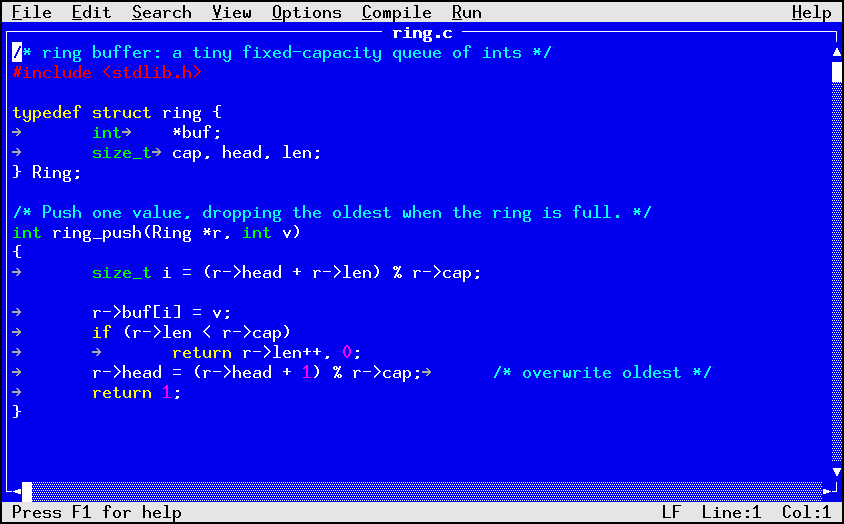

# Getting started

Starting the editor, reading the screen, opening and saving a file, and
quitting. Everything here uses the default keys.

## Starting

```sh
vedit                   # an empty, unnamed buffer
vedit notes.txt         # open a file
```

A file that does not exist yet opens as an empty buffer with that name, and
is created on the first save. vedit needs a terminal on both standard input
and standard output.

## The screen



From top to bottom:

- **The menu bar.** File, Edit, Insert, Search, View, Options, Terminal,
  Help, and menus that appear only when they apply: Compile, Run, VCS%,
  and Mail. A menu none of whose items can act right now is hidden, so
  Insert leaves while a view has no text cursor. On a narrow screen the
  titles that would collide with Help are not drawn, but Alt+letter
  still opens them.
- **The frame.** The file name sits in the top border, as `[2/3] name`
  when more than one file is open, or `Untitled` for a new buffer. The
  right border is a scrollbar, and the bottom border scrolls sideways.
  With two panes (chapter 3) each pane has its own title.
- **The text.**
- **The status line.** On the left, `F1=Help` and, in a version control
  working copy, the system and branch, as `git:main`, with `*` added
  when the file has uncommitted changes and `?` when it is untracked. A
  mode tag such as `-- DRAW --` comes before `F1=Help`, and the table
  view puts the cell address and value there. On the right, the
  line-ending style (`LF`, `CRLF`, or `NUL`), `Line:N  Col:N`, and a `*`
  when the buffer has unsaved changes. Flags such as `WRAP`, `NUM`, and
  `RO` appear here when those view settings are on or the buffer is
  read-only. A message from the editor, such as `wrote
  notes.txt`, replaces the left part until the next key.

## Typing and moving

Type to insert text at the cursor. Enter splits the line, Backspace deletes
to the left, Delete to the right. The arrow keys move one character or
line. Home and End go to the start and end of the line, PgUp and PgDn move
a screen, Ctrl-Home and Ctrl-End go to the start and end of the file.
Hold Shift while moving to select text.

Chapter 2 covers editing in full.

## Saving

Ctrl-S, or File > Save, writes the buffer. A buffer that has no name yet
asks for one in the file browser (chapter 3). File > Save As writes under a
new name.

The new contents are written to a temporary file in the same directory
and then renamed over the original. In a directory where that is not
allowed, the file is written in place.

## Quitting

Ctrl-Q, or File > Exit. For each file with unsaved changes it asks:

```
Save changes to notes.txt before exiting?
[ Yes ]  [ No ]  [ Cancel ]
```

Yes saves and quits, No quits and discards, Cancel returns to the editor.
For a buffer with no name, Yes opens the file browser first, and
cancelling there cancels the quit.
Choose a button with the arrow keys and Enter, or press its letter: `y`,
`n`, or `c`. Esc is Cancel.

## The menu bar

Everything the editor can do is in the menus, with the key beside the item
when it has one, so the menus are the place to look when you forget a key.

- **F10** activates the bar. Then the arrow keys move between menus and
  items, Enter runs the item, and Esc backs out.
- **Alt+letter** opens a menu directly: the underlined letter of its name,
  so Alt+F for File and Alt+V for View. If the terminal takes Alt+letter
  for itself, use F10 and then the letter.
- Inside a menu, an item's underlined letter runs it.
- A mouse click on the bar opens that menu (chapter 2 covers the mouse).

An item that cannot act right now is grayed and skipped: Paste with an
empty clipboard, Undo with nothing to undo. A whole menu is hidden when
none of its items apply: Compile appears once a compile or build command
is configured for the file's language, and Run once a run command is, or
once a build has produced output.

## Help

- **F1** shows the key bindings of the active personality. Up and Down
  scroll it, PgUp, PgDn, and Space page, Home and End jump, and Esc,
  Enter, or `q` returns.
- **Help > Tutorial**, or `t` on the F1 screen, opens the built-in
  walkthroughs: draw mode, terminal buffers, the art view, the table view,
  and crash recovery.
- **Help > About** shows the version.

## Two sets of keys

vedit has two personalities. The default is the modeless EDIT personality
described in this chapter and the next: keys always insert text, and
commands are control keys and menus. The other is a vi: keys are commands
until you enter insert mode. **F2** switches between them (from the vi insert mode, press Esc
first), and the status line shows `-- NORMAL --` or `-- INSERT --` while the vi keys are active.
The vi personality is described in chapter 6, which assumes no previous
knowledge of vi. The config file can make it the default (chapter 5).

## If the editor dies

If vedit or the connection drops while a file has unsaved changes, start it
again on the same file. It finds the recovery journal it kept beside the
file and asks:

```
Unsaved changes found. (r)ecover (o)pen (d)elete (q)uit?
```

Press `r` to get the unsaved work back, then save. `q` at this prompt
quits vedit. Chapter 3 explains what
the journal is and the other answers.
