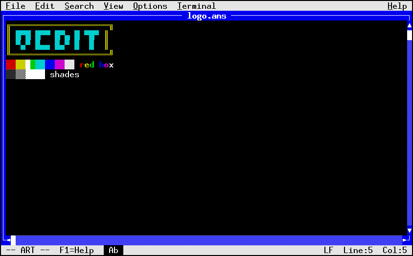
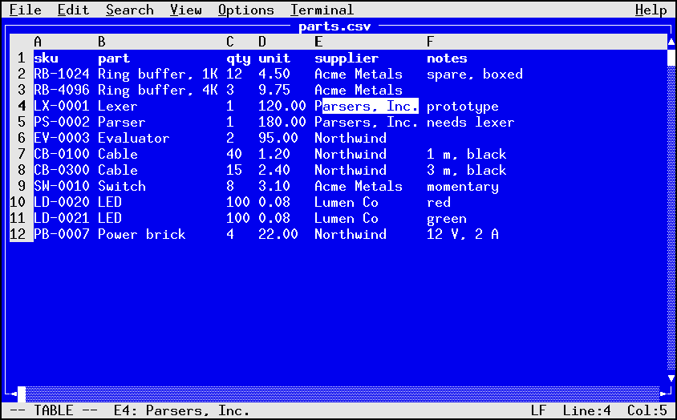
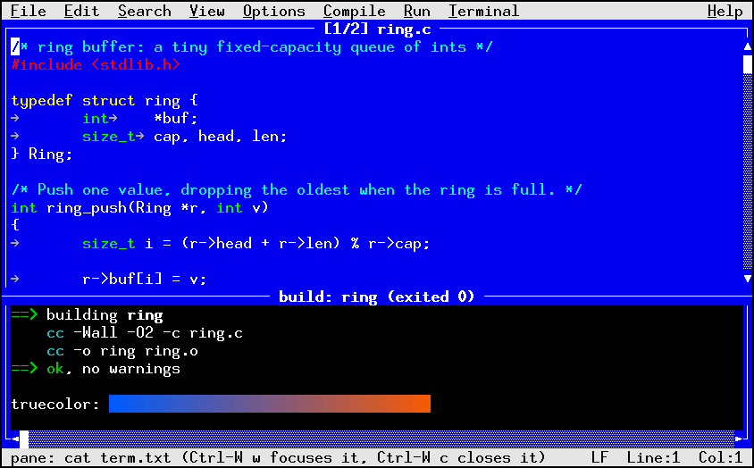
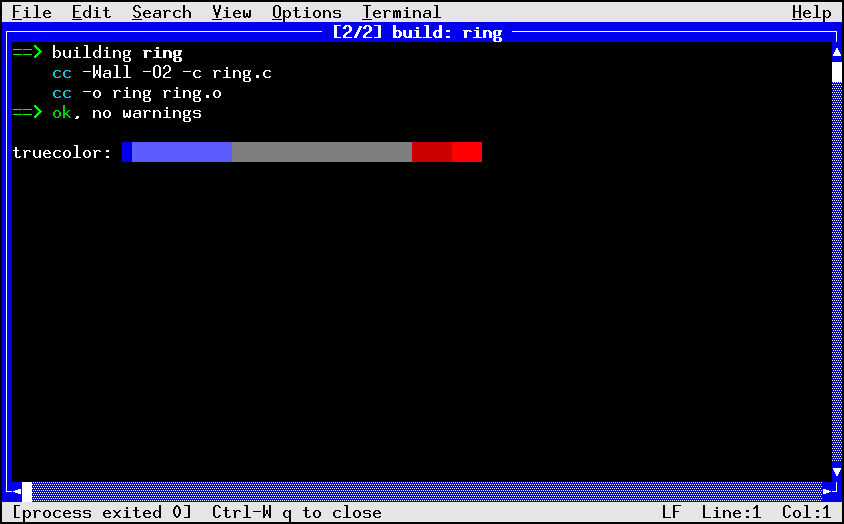
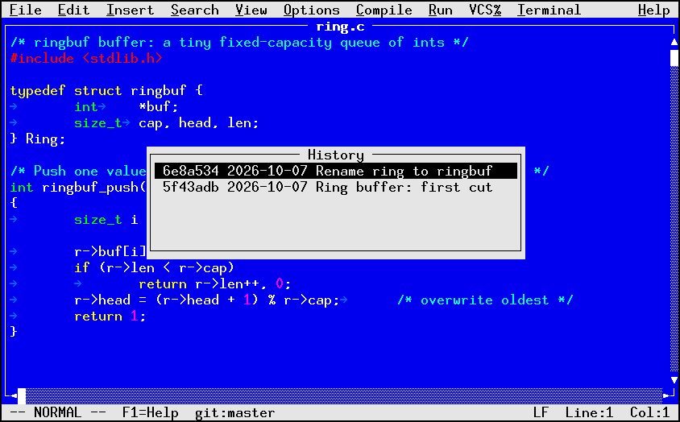
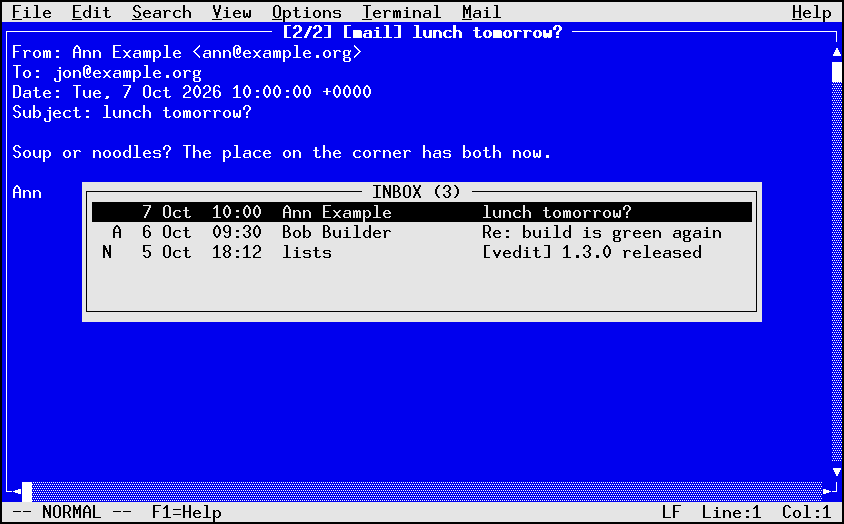
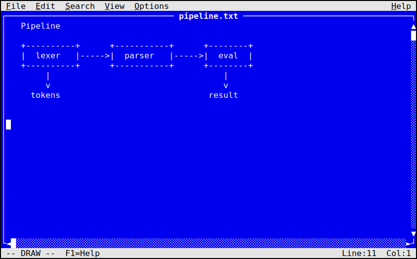

# Showcase

Things to try, with the pictures. Each one points at the chapter that
describes it.

## Color text art

```sh
vedit docs/space.ans
```



Three scenes ship in `docs/`: `space.ans`, `mountain.ans`, and
`beach.ans`. Alt+Up cycles the pen color, Alt+C opens the palette, and
Shift+arrows then Ctrl-B boxes a region. Chapter 8.

## A spreadsheet-like view of a CSV file

```sh
vedit data.csv
```



`:colwidth fit all` fits every column, `:sort! n` sorts the rows by the
cursor column in descending numeric order, and Enter edits a cell.
Chapter 8.

## A build with its errors in the pane

```ini
[command "c"]
    compile = gcc -Wall -c $(filename) -o $(filenoext).o
    build   = make
    run     = ./$(filenoext)
```



F9 runs make in a terminal under the file, the cursor lands on the first
error, and F4 steps through the rest. Chapter 7.

## A shell inside the editor



`:terminal` opens a shell in a buffer, `:split` opens one in the pane,
and Ctrl-W R turns a terminal's colored output into an `.ans` file.
Chapter 7.

## Git history without leaving the file



The status line shows `git:main*`. F10 then `%` opens the VCS menu:
History picks a commit and shows its diff, Blame leads each line with its
revision, and Commit writes the message in a buffer. Chapter 7.

## Mail



With `mail.dir` pointed at a Maildir, Mail > Folders lists the folders,
a message opens as a buffer, and `:reply` quotes it. Chapter 8.

## A diagram drawn in a source file



Press Insert, move the cursor anywhere, type, and box a region with
Shift+arrows and Ctrl-B. Alt+1 to Alt+0 insert box-drawing glyphs.
Chapter 8.

## A theme of your own

```ini
[ui]
    scheme = midnight

[theme "midnight"]
    base       = black
    content.fg = 189
    frame.fg   = 60
    title.fg   = "#ffd787"
    bar.fg     = 231
    bar.bg     = 54
    guide.fg   = 60
```

Chapter 10.

## Column editing with the vi keys

```
Ctrl-V 5j I// Esc
```

Select a block five lines tall, then `I`, type `//`, and Esc comments all
six lines. `:g/TODO/d` deletes every line containing `TODO`, and
`:%s/\<foo\>/bar/g` renames a word throughout the file. Chapter 6.

## A 200 MB log file

Opening a file maps it rather than reading it, so a 200 MB file of four
million lines opens in a tenth of a second and costs 32 MB of memory.
Chapter 3.

## Over a slow link

`vedit --scroll --16color --dec` suits a telnet session to a terminal
emulator that knows only the VT100 line-drawing set and sixteen colors.
Only the rows and columns that changed are sent on each redraw.
`docs/demo.html` is a self-contained page showing the byte counts.
Chapter 9.
